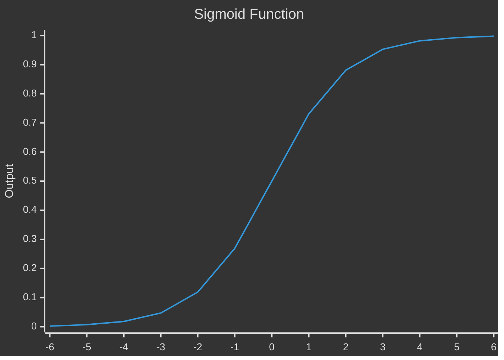

**Notations:**
     $(x, y) \ \ \  x \in \mathbb{R}^x, \ \ \ y \in \{0, 1\}$ 
     $\textbf{Number of training examples } (m_{train}): \{(x^{(1)}, y^{(1)}), (x^{(2)}, y^{(2)}), \dots, (x^{(m)}, y^{(m)})\}$     
     $\textbf{Number of training examples } (m_{test})$ 
     $X = [X^{(1)} \ X^{(2)} \ ....... \ X^{(m)}] \ \ \ \ \ \ \textbf{is a } (n_x, m) \textbf{ dimension matrix}$ 
     $Y = [Y^{(1)} \ Y^{(2)} \ ....... \ Y^{(m)}] \ \ \ \ \ \ \textbf{is a } (1, m) \textbf{ dimension matrix}$ 

### Logistic Regression 
Given x, we want to find $\hat{y} = P(y = 1 | x)$ such that $x \in \mathbb{R}^x$   
Parameter:  $w \in \mathbb{R}^x$, $b \in \mathbb{R}$ 
Output: $\hat{y} = \sigma(w^Tx + b) = \sigma(z)$  
Here $\sigma(z)$ is the sigmoid function. It is defined as:

$$\sigma(z) = \frac{1}{1+e^{-z}}$$
#### Cost Function 
Given $\{(x^{(1)}, y^{(1)}), (x^{(2)}, y^{(2)}), \dots, (x^{(m)}, y^{(m)})\}$, we want $\hat{y}^{(i)} \approx y^{(i)}$ we define a loss function to see how well our model is working. $$L(\hat{y}, y) = -(ylog(\hat{y}) + (1-y)log(1-\hat{y})) \tag{1}$$ 
A lost function is defined on a single training point, we want to see how well out model works on the whole training set, so we use the cost function: $$J(w, b) = \frac{1}{m}\sum_{i = 1}^{m} L(\hat{y}^{(i)}, y^{(i)}) = \frac{-1}{m}\sum_{i = 1}^{m} ylog(\hat{y}) + (1-y)log(1-\hat{y})) \tag{2}$$ 

#### Gradient Descent
We need to find the parameter w and b so that we get a minimum graph. For this we use gradient descent. We repeatedly do the following update: $$w:= w - \alpha\frac{\partial J(w, b)}{\partial w}$$ Where $\alpha$ is learning rate. Similarly for b we get $$b := b - \alpha\frac{\partial J(w,b)}{\partial b}$$ 
[[Computation Graph]] 

Let us consider that our model has two features $x_1$ and $x_2$. Then we get 
$$\{ x_1, w_1, x_2, w_2, b\} \longrightarrow \boxed{z = w_1x_1 + w_2x_2 + b} \longrightarrow \boxed{a = \sigma(z)} \longrightarrow \boxed{L(a,y)}$$ We want to find $$\frac{\partial L}{\partial w_1} = \frac{\partial L}{\partial a} \frac{\partial a}{\partial z} \frac{\partial z}{\partial z_1}$$ Now we compute $\frac{\partial L}{\partial a}$ we get loss as: $$L = -[ylog(a) + (1-y)log(1-a)]$$$$\frac{\partial L}{\partial a} = -[\frac{y}{a} + (1-y)\frac{-1}{1-a}] = \frac{a - y}{a(1-a)}$$ Also $$\frac{\partial a}{\partial z} = a(1-a)$$ Thus finally we get $$\frac{\partial L}{\partial w_1} = (a-y)x_i$$
We use this to update the parameters as $w_1 \longleftarrow w_1 - \alpha(a - y)x_1$. This is gradient descent on a single training example. We have to implement this for all of them to minimize the cost function.
$$\{ x_1, w_1, x_2, w_2, b\} \longrightarrow \boxed{z = w_1x_1 + w_2x_2 + b} \longrightarrow \boxed{a = \sigma(z)} \longrightarrow \boxed{L(a,y)} \longrightarrow \boxed{J(w_1, w_2, b)}$$ Here $L$ and $J$ are defined by equation 1 and 2 respectively.

[[Vectorization]] 

Here is the python code for a multiple iteration of gradient descent:
```python
for i in range(iterations):  
  
Z = np.dot(w.T, X) + b    
A = 1 / (1 + np.exp(-Z))    
dZ = A - Y  
  
dW = (1 / m) * np.dot(X, dZ.T)  
db = (1 / m) * np.sum(dZ)  
  
w = w - alpha * dW  
b = b - alpha * db

```


[[Neural Network]] [[Multi-Class Classification]] 